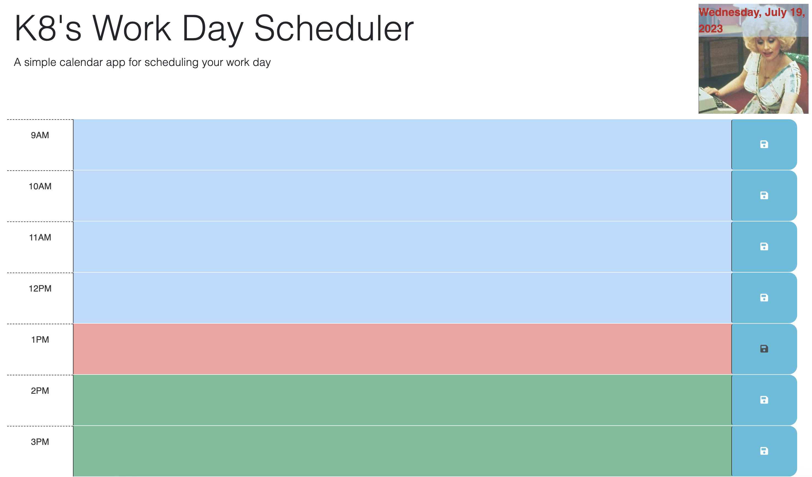
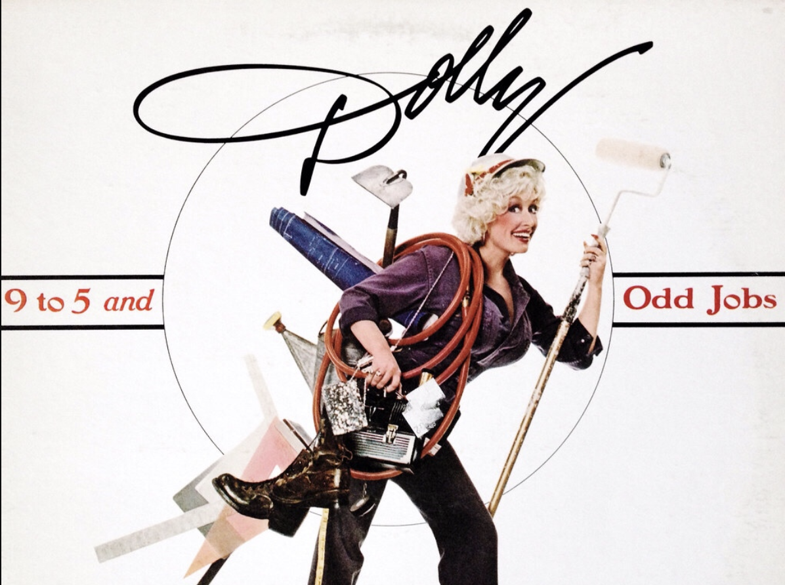

# k8s workday scheduler
## Description
I made this application in order to maximize my workday efficiency. As an artist with multiple projects underway in different stages with differenet collaborators, I needed something flexible and interactive that I could adjust if and when unexpected rescheduling occurs. Aesthtics inspired by Dolly Parton.

💝 [Test your knowledge with my JavaScript quiz here](https://k8sterchi.github.io/k8s-scheduler/) 💝

## Application Preview

## User Story
As an artist with a busy schedule, I want to add important events to a daily planner so that I can manage my time effectively.
## Acceptance Criteria
GIVEN I am using a daily planner to create a schedule

WHEN I open the planner

THEN the current day is displayed at the top of the calendar

WHEN I scroll down

THEN I am presented with time blocks for standard business hours of 9am to 5pm

WHEN I view the time blocks for that day

THEN each time block is color-coded to indicate whether it is in the past, present, or future

WHEN I click into a time block

THEN I can enter an event

WHEN I click the save button for that time block

THEN the text for that event is saved in local storage

WHEN I refresh the page

THEN the saved events persist
## Resources
I screenshot the image of Dolly from this article https://www.theguardian.com/commentisfree/2014/oct/27/five-myths-about-career-women and cropped it into a square.

I used this started code to begin making my scheduler appliction. 
## Inspiration
